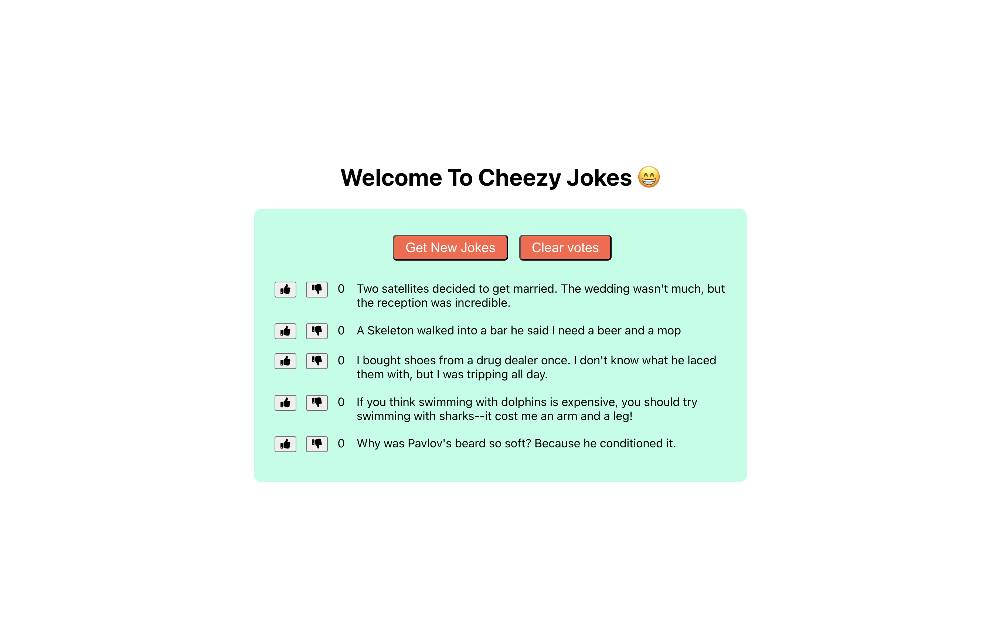

# React JokeList



This is a React application that displays a list of jokes fetched from an external API. Users can vote on jokes and see them sorted based on the number of votes they receive. Additionally, users can generate new jokes or clear all votes.

## Features

- Fetches jokes from the "icanhazdadjoke" API.
- Allows users to vote on jokes.
- Displays jokes sorted by the number of votes.
- Enables users to generate new jokes or clear all votes.
- Uses local storage to persist joke data.

## Usage

1. Clone the repository:

   ```bash
   git clone <repository-url>
   ```

2. Navigate to the project directory:

   ```bash
   cd joke-list-app
   ```

3. Install dependencies:

   ```bash
   npm install
   ```

4. Start the development server:

   ```bash
   npm start
   ```

## Components

### JokeList Component

The `JokeList` component is responsible for fetching jokes from the API, managing joke data, and rendering the list of jokes.

#### Props

- `numJokesToGet`: The number of jokes to fetch from the API (default is 5).

### Joke Component

The `Joke` component represents a single joke item in the list. It displays the joke text, along with vote up/down buttons.

#### Props

- `id`: Unique identifier for the joke.
- `vote`: Function to handle voting on the joke.
- `votes`: Number of votes received for the joke.
- `text`: Text of the joke.

## License

This project is licensed under the MIT License - see the [LICENSE](LICENSE) file for details.
